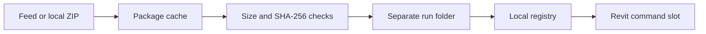

# Revit DevLoader

Versioned test plugins for Revit, installed from a feed and loaded from separate run folders.

 [](https://github.com/sharafutdinovdi/revit-devloader/actions/workflows/ci.yml) [](https://github.com/sharafutdinovdi/revit-devloader/actions/workflows/codeql.yml) [](https://github.com/sharafutdinovdi/revit-devloader/releases)  [](LICENSE)

## What it does

Revit DevLoader installs test plugins from versioned ZIP packages.
The manager discovers packages from a feed and loads installed commands through the Revit ribbon.
Each installation gets a separate run folder and a local registry entry.

## Why

Testing a new plugin build often requires replacing files that Revit has already loaded.
DevLoader keeps each installation in a separate directory.
A feed supplies release metadata and package locations without rebuilding the loader for each plugin.
GitHub Releases can serve private feeds through the locally authenticated GitHub CLI.

## In action

A recording of the catalog, install, update and uninstall flow is being redone and will land here.

## Quick start

Run these commands in PowerShell on Windows with Revit closed.
Install Git and the .NET SDK selected by [global.json](global.json).
Revit is needed to run the add-in; its API references restore from NuGet during the build.

1. Clone, build for Revit 2026 and create the installer ZIP:

   ```powershell
   Set-ExecutionPolicy -Scope Process -ExecutionPolicy Bypass
   git clone https://github.com/sharafutdinovdi/revit-devloader.git
   Set-Location revit-devloader
   .\build\build-all.ps1 -Versions 2026
   .\build\installer\package.ps1 -SkipBuild
   Expand-Archive -LiteralPath .\build\release\packages\RevitDevLoader-revit-2026-2026.zip -DestinationPath .\artifacts\installer
   & .\artifacts\installer\install.ps1 -RevitVersion 2026
   ```

   The execution-policy setting applies only to the current PowerShell session.
   The installer writes `%APPDATA%\Autodesk\Revit\Addins\2026\RevitDevLoader.addin` and the adjacent `RevitDevLoader` folder.
   For another year, change `-Versions`, the ZIP filename and `-RevitVersion` together.
   Omitting `-Versions` builds all configured years.
   Prebuilt folders are also available as **Legacy** and **Modern** artifacts on successful [CI runs](https://github.com/sharafutdinovdi/revit-devloader/actions/workflows/ci.yml).
   Tagged [releases](https://github.com/sharafutdinovdi/revit-devloader/releases) provide an installer ZIP with the same `install.ps1` command.

2. Start Revit and open **Add-Ins > DevLoader > Dev**.
   Open **Settings** and enter your feed repository, release tag and `feed.json` asset name.
   GitHub release feeds require GitHub CLI in PATH and `gh auth login` on that Windows account.
   There is no default feed or release tag.
   A local or HTTPS feed can instead be set with `feedUrl` in `%LOCALAPPDATA%\RevitDevLoader\settings.properties`.

3. Select **Check for updates**, then **Install** on a compatible payload.
   The row changes to installed and a `.devmanifest` file appears under `%LOCALAPPDATA%\RevitDevLoader\plugins`.
   Command payloads receive a ribbon button; close the manager to run it.
   Application payloads load on the next Revit start.

The [demo feed](https://github.com/sharafutdinovdi/revit-devloader/releases/tag/demo-feed) uses repository `sharafutdinovdi/revit-devloader`, tag `demo-feed` and asset `feed.json`.
It lists Hello Plugin, Element Counter and Level Lister at 1.0.0 for Revit 2025 and 2026.
Install Hello Plugin, close the manager and click **Hello Plugin** on the ribbon.
The dialog displays **This is your first plugin** with the standard OK button.

### Create your own plugin from `samples/HelloPlugin`

Run from the repository root on Windows:

```powershell
Copy-Item .\samples\HelloPlugin .\samples\MyPlugin -Recurse
Rename-Item .\samples\MyPlugin\HelloPlugin.csproj MyPlugin.csproj
notepad .\samples\MyPlugin\HelloCommand.cs
notepad .\samples\MyPlugin\plugin.json
.\tools\feed\Build-Package.ps1 -Project .\samples\MyPlugin -Version 1.0.0 -OutputDir .\artifacts\my-plugin
```

In `plugin.json`, set `id` to `my-plugin`, `displayName` to the chosen name and `entry.assembly` to `2026/MyPlugin.dll`.
Keep `commands[0].class` as `HelloPlugin.HelloCommand` unless the C# namespace or class is renamed.
Edit the dialog text in `HelloCommand.cs` and the SVG/PNG artwork under `icons/`.
The project inherits the shared sample build properties and compiles for both Revit years.
The result is `artifacts/my-plugin/my-plugin-1.0.0.zip` with its manifest, DLLs and icons.

Create a release in a repository you own, then publish its channel:

```powershell
$feedRepo = 'OWNER/REPO'
gh release create preview --repo $feedRepo --title 'Plugin preview' --notes 'Plugin packages'
.\tools\feed\Publish-DevLoaderFeed.ps1 -InputDir .\artifacts\my-plugin -Repo $feedRepo -Tag preview
```

Set that repository and `preview` tag in DevLoader Settings, then select **Check for updates > Install**.
For the next release, rebuild with `-Version 1.1.0`, publish again and select **Check for updates > Update**.
See [plugin package format](docs/plugin-package.md) for multiple commands, application packages and assembly selection.

## How it works



The installer checks extraction paths against the destination folder.
Reinstalls use a new run folder and update the registry without overwriting the previous run.
The cache verifies SHA-256 when the feed supplies a hash and verifies size when it is positive.
Command slots resolve the installed assembly path and invoke the command through reflection.
See [how it works](docs/how-it-works.md) for loading limits and retention behavior.

## Tools

| Feature | Behavior |
|---|---|
| Generic catalog | Combines feed packages and registered plugins. |
| GitHub Releases | Uses `gh` authentication for public or private release assets. |
| Package checks | Compares supplied hashes and sizes before installation. |
| Run folders | Preserves existing runs when a release is reinstalled. |
| Manifest ribbon | Adds one button per installed command with package text, tooltip and icons. |
| `Build-Package.ps1` | Builds a sample for every declared Revit year and creates a v2 ZIP. |
| `New-DevLoaderPackage.ps1` | Packages existing year folders with a v2 manifest and icons. |
| `Publish-DevLoaderFeed.ps1` | Publishes package versions, descriptions and icon assets in a v3 channel registry. |
| Application plugins | Writes an application `.addin` manifest for the next Revit start. |
| Local fallback | Scans local ZIP packages when the feed is absent or fails. |

## Feed format

A v3 JSON registry describes releases and points to ZIP packages with `plugin.json`, per-year assembly folders and icons.
Existing key-value DevPayload packages remain supported.
See [feed format and publishing](docs/feed-format.md) for schemas, settings, examples and package commands.

## Testing

The xUnit suite covers feed parsing, package extraction, registry writes and run retention.
It also covers settings precedence, assembly path loading and manager row states.
The ordinary test suite does not require Revit.

[Windows CI](https://github.com/sharafutdinovdi/revit-devloader/actions/workflows/ci.yml) builds Revit 2022-2026 before running the suite.
This includes the release manifest layout check.
To run the same build and tests from the repository root on Windows:

```powershell
.\build\build-all.ps1 -SkipTests
dotnet test tests/RevitDevLoader.Core.Tests -c Release
.\build\installer\package.ps1 -SkipBuild
```

The feed delivery smoke test performs work only when `REVITDEVLOADER_FEED_CHECK=1` is set.
It uses the configured feed and installs payloads into the current user's loader directories.
It is not enabled in CI.
Ordinary tests verify contracts without opening Revit; they do not establish live compatibility for every supported year.

## Compatibility

| Component | Configured support |
|---|---|
| Legacy add-in | Revit 2022-2024, `net48`, Windows |
| Modern add-in | Revit 2025-2026, `net8.0-windows`, Windows |
| Core | `net48;net8.0` |
| Tests | `net8.0` |
| Plain Release builds | Revit 2023 for Legacy, Revit 2026 for Modern |
| Build matrix | `Debug.R22` through `Release.R26`, split by add-in family |
| Revit API references | NuGet packages selected by Revit year |

The sample packages target Revit 2025 and 2026.
Live command execution still requires validation inside Revit.
See [known gaps](docs/roadmap.md#known-gaps) for the remaining limitations.
Replacing an application payload requires restarting Revit.
Command loading does not unload previously loaded assemblies or reset plugin static state.

## Author and license

Author and maintainer: Dinar Sharafutdinov.
Licensed under [MIT](LICENSE).
See [third-party notices](THIRD-PARTY-NOTICES.md) for dependency licenses.
