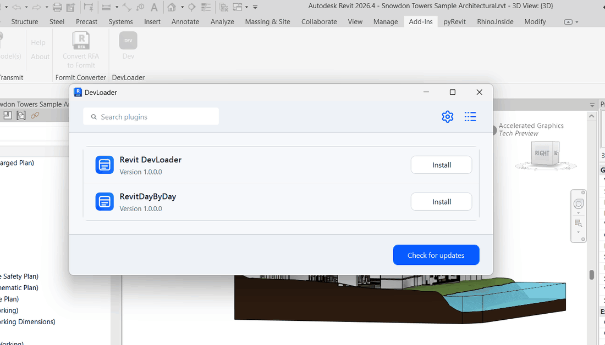

# Revit DevLoader

For Revit add-in developers who test builds across Revit 2022-2026: install versioned test plugins from a feed, run each version from its own folder, and update or uninstall without touching files that Revit has already loaded.

       

## Install

1. Download `revit-devloader-<version>-user-setup.exe` from the [latest release](https://github.com/sharafutdinovdi/revit-devloader/releases/latest). Use `revit-devloader-<version>-admin-setup.exe` to install for all users on the machine.
2. Close Revit, run the installer and keep the Revit years it detected, or pick your own.
3. Start Revit and open **Add-Ins > DevLoader > Dev**.

The release also carries `revit-devloader-<version>.zip` with `install.ps1` for scripted installs and `SHA256SUMS.txt` for every asset; see the [installer guide](build/installer/README.md). After the WinGet listing is accepted, `winget install Sharafutdinov.RevitDevLoader` installs the same user setup.

[Verify downloads](build/installer/README.md#verify-downloads) with GitHub CLI to check the build provenance before installing.

**First feed.** Open **Settings** in the manager and enter a feed repository, release tag and `feed.json` asset name. The demo feed is repository `sharafutdinovdi/revit-devloader`, tag `demo-feed`, asset `feed.json`; it lists three sample plugins for Revit 2025 and 2026. GitHub release feeds need GitHub CLI in PATH and `gh auth login` on that Windows account. There is no default feed.

## In action

Recorded in Revit 2026 against the demo feed. The catalog lists the three packages from `samples/` with their icons. Install adds the Hello Plugin button and the plugin runs. A newer version reaches the feed, Check for updates shows `1.0.0 → 1.1.0` and Update installs it. Uninstall removes the registration and hides the button.

## What it does

- Discovers plugin packages from a GitHub release feed, an HTTPS or local feed, or local ZIP files.
- Installs versioned ZIP packages with a `plugin.json` manifest, per-year assemblies and PNG icons; older key-value packages still load.
- Runs each installed version from its own folder, so a new build never overwrites files that Revit holds open.
- Generates one ribbon button per declared command with the package icon, and registers application plugins for the next Revit start.
- Updates, uninstalls, opens the plugin folder and shows installed versions from the manager window.

## How it works

| Component | Responsibility |
|---|---|
| Feed | JSON registry with releases, package URLs, sizes and SHA-256 hashes |
| Package cache | Downloads through `gh` or HTTPS, verifies size and hash before extraction |
| Run folder | One directory per installation under `%LOCALAPPDATA%\RevitDevLoader\plugins` |
| Registry | `.devmanifest` files that map installed packages to run folders and commands |
| Ribbon | Buttons resolve the installed assembly and invoke the command through reflection |

Details: [how it works](https://sharafutdinovdi.github.io/revit-devloader/how-it-works/), [feed format and publishing](https://sharafutdinovdi.github.io/revit-devloader/feed-format/), [plugin package format](https://sharafutdinovdi.github.io/revit-devloader/plugin-package/), [roadmap and known gaps](https://sharafutdinovdi.github.io/revit-devloader/roadmap/).

## Compatibility

| Add-in | Revit years | Target framework |
|---|---|---|
| Legacy | 2022, 2023, 2024 | `net48` |
| Modern | 2025, 2026 | `net8.0-windows` |

Windows only. Revit API references restore from NuGet per year; no Autodesk assemblies ship in any artifact. Command loading does not unload previously loaded assemblies, and replacing an application plugin requires a Revit restart.

## Contributing and support

[Documentation](https://sharafutdinovdi.github.io/revit-devloader/).

Read [CONTRIBUTING.md](CONTRIBUTING.md) for the build from source, the sample plugin walkthrough and the release ritual. Bugs and feature requests use the [issue forms](https://github.com/sharafutdinovdi/revit-devloader/issues/new/choose); questions go to [Discussions](https://github.com/sharafutdinovdi/revit-devloader/discussions); vulnerabilities follow [SECURITY.md](SECURITY.md).

170 xUnit tests cover feed parsing, package extraction, registry writes, run retention, settings and manager state, and run on every push without Revit. Windows CI then builds all five Revit years, checks the release layout, and installs and removes both setup executables. See the [changelog](CHANGELOG.md) for what changed in each version.

## Contributors

## License

[MIT](LICENSE). Author and maintainer: Dinar Sharafutdinov. Third-party licenses are listed in [THIRD-PARTY-NOTICES.md](THIRD-PARTY-NOTICES.md).
