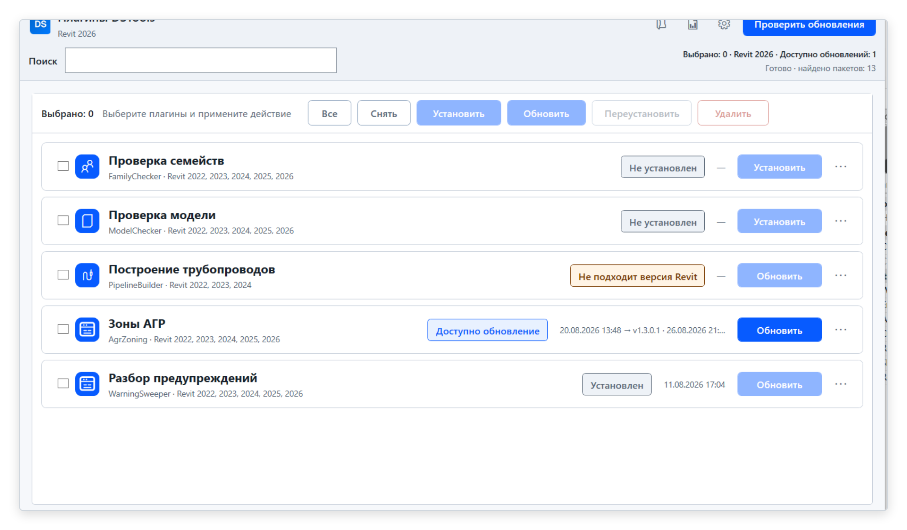
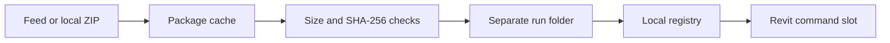

# Revit DevLoader

<!-- screenshot: hero, DevLoader dialog inside Revit, light and dark variants -->

 [](https://github.com/sharafutdinovdi/revit-devloader/actions/workflows/ci.yml)   [](LICENSE)

## What it does

Revit DevLoader installs test plugins from versioned ZIP packages.
The manager discovers packages from a feed and loads installed commands through the Revit ribbon.
Each installation gets a separate run folder and a local registry entry.

## Why

Testing a new plugin build often requires replacing files that Revit has already loaded.
DevLoader keeps each installation in a separate directory.
A feed supplies release metadata and package locations without rebuilding the loader for each plugin.
GitHub Releases can serve private feeds through the locally authenticated GitHub CLI.

## In action

<picture>
  <source media="(prefers-color-scheme: dark)" srcset="docs/screenshots/revit-devloader_catalog_dark.png">
  
</picture>

Captured in Revit 2026 on 2026-09-11 from the internal build the loader was extracted from, so the labels are still in Russian and carry the previous product name. The catalog reads one feed and shows, per payload, which Revit years it supports and whether it is installed, outdated or incompatible with the running Revit.

Live Revit screenshots are pending.

## Quick start

This checkout is unreleased.
Windows builds and live Revit validation are pending.
Build with the SDK selected by [global.json](global.json).

1. With Revit closed, build and package the add-in on Windows:

   ```powershell
   .\build\build-all.ps1 -Versions 2026
   .\build\installer\package.ps1 -SkipBuild
   ```

   Extract the ZIP from `build/release/packages` into an empty folder.
   Run `install.ps1 -RevitVersion 2026` from that folder.
   The installer copies the loader to the current user's Revit Addins directory.

2. Start Revit and open **Add-Ins > DevLoader > Dev**.
   Open **Settings** and enter the repository, release tag and `feed.json` asset name.
   For a private repository, authenticate with `gh auth login` on that Windows account first.
   There is no default feed or release tag.

3. Select **Check for updates**.
   Choose **Install** on a compatible command payload, then close the manager and run its ribbon button.
   A successful installation creates a registry entry under `%LOCALAPPDATA%\RevitDevLoader\plugins`.
   Application payloads load on the next Revit start.

A local or HTTPS feed can be set with `feedUrl` in `%LOCALAPPDATA%\RevitDevLoader\settings.properties`.
See [feed format and publishing](docs/feed-format.md) for package creation and placeholder samples.

## How it works



The installer checks extraction paths against the destination folder.
Reinstalls use a new run folder and update the registry without overwriting the previous run.
The cache verifies SHA-256 when the feed supplies a hash and verifies size when it is positive.
Command slots resolve the installed assembly path and invoke the command through reflection.
See [how it works](docs/how-it-works.md) for loading limits and retention behavior.

## Features

| Feature | Behavior |
|---|---|
| Generic catalog | Combines feed packages and registered plugins. |
| GitHub Releases | Uses `gh` authentication for public or private release assets. |
| Package checks | Compares supplied hashes and sizes before installation. |
| Run folders | Preserves existing runs when a release is reinstalled. |
| Command plugins | Assigns a persistent slot and adds a ribbon button. |
| Application plugins | Writes an application `.addin` manifest for the next Revit start. |
| Local fallback | Scans local ZIP packages when the feed is absent or fails. |

## Testing

The xUnit suite covers feed parsing, package extraction, registry writes and run retention.
It also covers settings precedence, assembly path loading and manager row states.
The ordinary test suite does not require Revit.

On Windows:

```powershell
dotnet build src/RevitDevLoader.Addin.Legacy -c Release
dotnet build src/RevitDevLoader.Addin.Modern -c Release
dotnet test tests/RevitDevLoader.Core.Tests
```

The feed delivery smoke test performs work only when `REVITDEVLOADER_FEED_CHECK=1` is set.
It uses the configured feed and installs payloads into the current user's loader directories.
The release layout check is skipped until `build/build-all.ps1` has produced release output.

<!-- screenshot: tests, successful Windows build and xUnit run -->

## Compatibility

| Component | Configured support |
|---|---|
| Legacy add-in | Revit 2022-2024, `net48`, Windows |
| Modern add-in | Revit 2025-2026, `net8.0-windows`, Windows |
| Core | `net48;net8.0` |
| Tests | `net8.0` |
| Plain Release builds | Revit 2023 for Legacy, Revit 2026 for Modern |
| Build matrix | `Debug.R22` through `Release.R26`, split by add-in family |
| Revit API references | NuGet packages selected by Revit year |

Configured support still requires Windows build and live Revit validation.
Replacing an application payload requires restarting Revit.
Command loading does not unload previously loaded assemblies or reset plugin static state.

## Author and license

Author and maintainer: Dinar Sharafutdinov.
Licensed under [MIT](LICENSE).
See [third-party notices](THIRD-PARTY-NOTICES.md) for dependency licenses.
