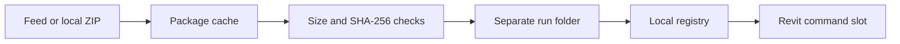

# Revit DevLoader

<!-- screenshot: hero, DevLoader dialog inside Revit, light and dark variants -->

 [](https://github.com/sharafutdinovdi/revit-devloader/actions/workflows/ci.yml)   [](LICENSE)

## What it does

Revit DevLoader installs test plugins from versioned ZIP packages.
The manager discovers packages from a feed and loads installed commands through the Revit ribbon.
Each installation gets a separate run folder and a local registry entry.

## Why

Testing a new plugin build often requires replacing files that Revit has already loaded.
DevLoader keeps each installation in a separate directory.
A feed supplies release metadata and package locations without rebuilding the loader for each plugin.
GitHub Releases can serve private feeds through the locally authenticated GitHub CLI.

## In action


Recorded in Revit 2026 on 2026-09-11 against the demo feed published as a GitHub Release of this repository: open the catalog from the Add-Ins tab, install a payload, and the row turns to installed with a reinstall option. Application payloads are picked up by Revit on the next start.

<picture>
  <source media="(prefers-color-scheme: dark)" srcset="docs/screenshots/revit-devloader_catalog_dark.png">
  
</picture>

## Quick start

This checkout is unreleased.
The Windows builds and Revit 2026 installation are verified.
Live validation of this build inside Revit is pending.
Build with the SDK selected by [global.json](global.json).

1. With Revit closed, build and package the add-in on Windows:

   ```powershell
   .\build\build-all.ps1 -Versions 2026
   .\build\installer\package.ps1 -SkipBuild
   ```

   Extract the ZIP from `build/release/packages` into an empty folder.
   Run `install.ps1 -RevitVersion 2026` from that folder.
   The installer copies the loader to the current user's Revit Addins directory.

2. Start Revit and open **Add-Ins > DevLoader > Dev**.
   Open **Settings** and enter the repository, release tag and `feed.json` asset name.
   For a private repository, authenticate with `gh auth login` on that Windows account first.
   There is no default feed or release tag.

3. Select **Check for updates**.
   Choose **Install** on a compatible command payload, then close the manager and run its ribbon button.
   A successful installation creates a registry entry under `%LOCALAPPDATA%\RevitDevLoader\plugins`.
   Application payloads load on the next Revit start.

A local or HTTPS feed can be set with `feedUrl` in `%LOCALAPPDATA%\RevitDevLoader\settings.properties`.
See [feed format and publishing](docs/feed-format.md) for package creation and placeholder samples.

The private [demo feed](https://github.com/sharafutdinovdi/revit-devloader/releases/tag/demo-feed) contains RevitDayByDay 1.0.0 and Revit DevLoader 0.1.0 for Revit 2026.
Accounts with repository access can configure it in `%LOCALAPPDATA%\RevitDevLoader\settings.properties`:

```properties
feedRepo=sharafutdinovdi/revit-devloader
feedTag=demo-feed
feedAsset=feed.json
runRetentionCount=3
useLocalUpdatesFallback=false
```

Both demo packages are application payloads and require a Revit restart after installation.
The DevLoader payload demonstrates feed delivery of the loader assembly.
It creates a separate `revit-devloader.addin` and does not replace the bootstrap installation in `RevitDevLoader.addin`.
Installing it alongside the bootstrap can load both copies; automatic bootstrap self-update is not implemented.

## How it works



The installer checks extraction paths against the destination folder.
Reinstalls use a new run folder and update the registry without overwriting the previous run.
The cache verifies SHA-256 when the feed supplies a hash and verifies size when it is positive.
Command slots resolve the installed assembly path and invoke the command through reflection.
See [how it works](docs/how-it-works.md) for loading limits and retention behavior.

## Features

| Feature | Behavior |
|---|---|
| Generic catalog | Combines feed packages and registered plugins. |
| GitHub Releases | Uses `gh` authentication for public or private release assets. |
| Package checks | Compares supplied hashes and sizes before installation. |
| Run folders | Preserves existing runs when a release is reinstalled. |
| Command plugins | Assigns a persistent slot and adds a ribbon button. |
| Application plugins | Writes an application `.addin` manifest for the next Revit start. |
| Local fallback | Scans local ZIP packages when the feed is absent or fails. |

## Testing

The xUnit suite covers feed parsing, package extraction, registry writes and run retention.
It also covers settings precedence, assembly path loading and manager row states.
The ordinary test suite does not require Revit.

The [Windows CI run](https://github.com/sharafutdinovdi/revit-devloader/actions/runs/34612472580) builds both add-in families and runs the core suite.
The Windows workstation run on 2026-09-11 passed after producing the Revit 2026 release layout:

```text
Passed!  - Failed:     0, Passed:   141, Skipped:     0, Total:   141, Duration: 1 s - RevitDevLoader.Core.Tests.dll (net8.0)
```

The Modern and Legacy Release builds each completed with zero warnings and zero errors.
The core feed reader downloaded the private demo feed through `gh` on Windows.
The package cache downloaded both Revit 2026 payloads and verified their SHA-256 hashes and sizes.

On Windows:

```powershell
dotnet build src/RevitDevLoader.Addin.Legacy -c Release
dotnet build src/RevitDevLoader.Addin.Modern -c Release
dotnet test tests/RevitDevLoader.Core.Tests
```

The feed delivery smoke test performs work only when `REVITDEVLOADER_FEED_CHECK=1` is set.
It uses the configured feed and installs payloads into the current user's loader directories.
The release layout check is skipped until `build/build-all.ps1` has produced release output.
CI does not produce that layout and reports 140 passed tests with one skipped check.

<!-- screenshot: tests, successful Windows build and xUnit run -->

## Compatibility

| Component | Configured support |
|---|---|
| Legacy add-in | Revit 2022-2024, `net48`, Windows |
| Modern add-in | Revit 2025-2026, `net8.0-windows`, Windows |
| Core | `net48;net8.0` |
| Tests | `net8.0` |
| Plain Release builds | Revit 2023 for Legacy, Revit 2026 for Modern |
| Build matrix | `Debug.R22` through `Release.R26`, split by add-in family |
| Revit API references | NuGet packages selected by Revit year |

Plain Release builds are verified on Windows for Revit 2023 and 2026.
Live Revit validation and builds for the other configured years are pending.
Replacing an application payload requires restarting Revit.
Command loading does not unload previously loaded assemblies or reset plugin static state.

## Author and license

Author and maintainer: Dinar Sharafutdinov.
Licensed under [MIT](LICENSE).
See [third-party notices](THIRD-PARTY-NOTICES.md) for dependency licenses.
